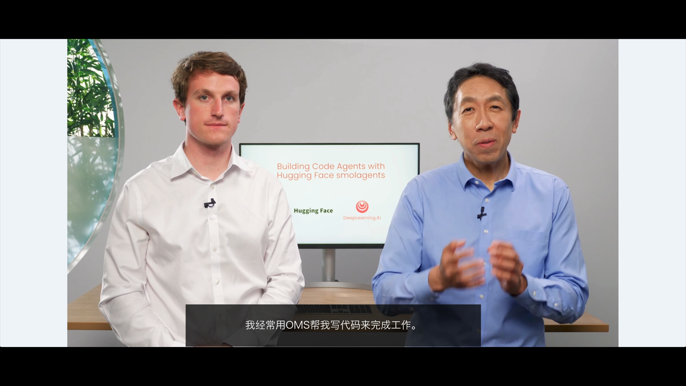

## Subtítulos en tiempo real

Una aplicación de subtítulos en tiempo real, de código abierto y ligera, para macOS que proporciona subtítulos en streaming bilingües de alta calidad al escuchar podcasts o ver videos. Utiliza Silero-Vad + Whisper para el reconocimiento automático del habla (ASR), y la API del modelo DeepSeek-V3 para la traducción de subtítulos.

[](https://www.youtube.com/watch?v=32uLnLP_coU)

Demo sin estilo de ventana:

[](https://www.youtube.com/watch?v=GUIAOTWzZTc)

Construir el proyecto:

```shell
git clone -b master git@github.com:ZuoFuhong/subtitle.git

# Desactivar el allocador de memoria Nano, requerido solo para macOS
export MallocNanoZone=0

mkdir -p build
cd build
cmake ..
make
```

Mejor experiencia en modo pantalla completa:

```shell
# DEEPSEEK_API_KEY (opcional)
export DEEPSEEK_API_KEY=sk-xxxxx
# o
export OPENAI_API_KEY=sk-xxxxx

cd build

# Modo offline
./main -mode offline -f ../resources/model -m parakeet-tdt-0.6b-v2 -llm gpt-4.1-mini

# Modo ASR en servidor
./main -mode server -s 9.135.97.184:8000
```

### 2. Reconocimiento del habla a texto

[Whisper](https://github.com/openai/whisper) ofrece varios tamaños de modelo, incluidos pequeño, mediano y grande. Diferentes tamaños de modelo varían en precisión, velocidad y requisitos de recursos computacionales.

```shell
# Descarga del modelo
# small.en solo admite inglés, rápido, adecuado para reconocimiento del habla en tiempo real
curl -L --output ggml-small.en.bin https://huggingface.co/ggerganov/whisper.cpp/resolve/main/ggml-small.en.bin

# medium.en solo admite inglés, velocidad moderada, excelente precisión, recomendado para conversión de subtítulos
curl -L --output ggml-medium.en.bin https://huggingface.co/ggerganov/whisper.cpp/resolve/main/ggml-medium.en.bin
```

Nota: Los modelos Whisper pueden alucinar severamente con largas pausas, música de fondo o audio inglés ruidoso.

A continuación, se muestra un ejemplo de ejecución del servicio ASR en modo offline usando [whisper.cpp](https://github.com/ggerganov/whisper.cpp):

```text
whisper_init_with_params_no_state: use gpu    = 1
whisper_init_with_params_no_state: flash attn = 0
whisper_init_with_params_no_state: gpu_device = 0
whisper_init_with_params_no_state: dtw        = 0
whisper_init_with_params_no_state: backends   = 3
whisper_backend_init_gpu: using Metal backend
ggml_metal_init: allocating
ggml_metal_init: found device: Apple M1 Pro
ggml_metal_init: picking default device: Apple M1 Pro
ggml_metal_init: using embedded metal library
ggml_metal_init: GPU name:   Apple M1 Pro
ggml_metal_init: GPU family: MTLGPUFamilyApple7  (1007)
ggml_metal_init: GPU family: MTLGPUFamilyCommon3 (3003)
ggml_metal_init: GPU family: MTLGPUFamilyMetal3  (5001)

And so my fellow Americans, ask not what your country can do for you, ask what you can do for your country.
```

### 3. Detección de actividad de voz

La Detección de Actividad de Voz (VAD) determina la presencia de voz en señales de audio analizando sus características. Efectivamente distingue y separa el habla de las señales no vocales.
Aquí, la VAD se utiliza para segmentar las porciones de habla para la transcripción de Whisper, lo que reduce considerablemente las alucinaciones y mejora la eficiencia y precisión del sistema de procesamiento del habla.


A continuación, se muestra el resultado de un modelo comercial en ejecución offline:

```json
{
	"sentences": [
		{"seId":"1", "seTime":1980, "sourceText":"AND SO MY FELLOW AMERICANS", "startTime":230, "endTime":2210},
		{"seId":"2", "seTime":900, "sourceText":"ASK NOT", "startTime":3290, "endTime":4190},
		{"seId":"3", "seTime":2020, "sourceText":"WHAT YOUR COUNTRY CAN DO FOR YOU", "startTime":5290, "endTime":7310},
		{"seId":"4", "seTime":2300, "sourceText":"ASK WHAT YOU CAN DO FOR YOUR COUNTRY", "startTime":8150, "endTime":10450}
	]
}
```

Usar ffmpeg para dividir segmentos de audio para verificación de reproducción:

```shell
ffmpeg -i jfk.wav -ss 00:00:00.230 -to 00:00:02.210 -acodec copy output1.wav
ffmpeg -i jfk.wav -ss 00:00:03.290 -to 00:00:04.190 -acodec copy output2.wav
ffmpeg -i jfk.wav -ss 00:00:05.290 -to 00:00:07.310 -acodec copy output3.wav
ffmpeg -i jfk.wav -ss 00:00:08.150 -to 00:00:10.450 -acodec copy output4.wav
```

A continuación, se muestran segmentos reconocidos en modo de transmisión por Silero-Vad + Whisper:

```shell
{"end":37376,"se_id":1,"start":5120,"text":"And so, my fellow Americans."}
{"end":86016,"se_id":2,"start":53760,"text":"Ask not."}
{"end":129024,"se_id":3,"start":87552,"text":"what your country can do for you."}
{"end":171008,"se_id":4,"start":131072,"text":"Ask what you can do for your country."}
```
