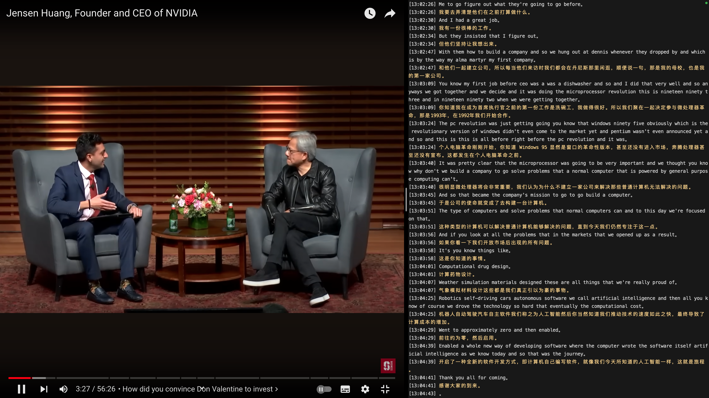
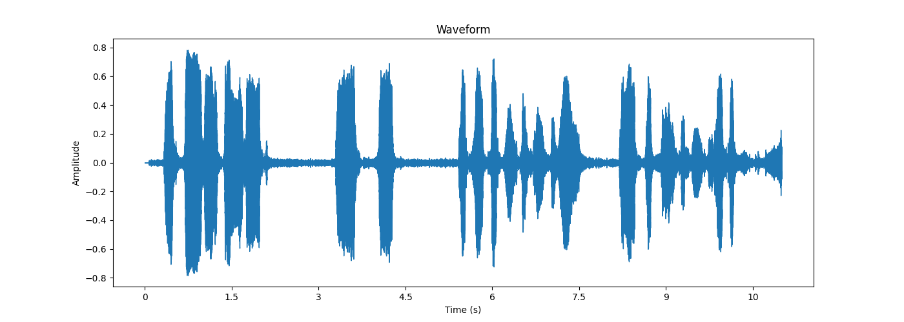

## 实时字幕

开源轻量的 macOS 实时字幕应用程序，在收听播客或观看视频时提供高质量的双语流式字幕。语音转写使用服务端 ASR 能力，翻译字幕使用 OpenAI gpt-3.5-turbo 模型接口。



安装运行时依赖：

```shell
# 依赖库
brew install sdl2 spdlog boost onnxruntime

# 音频路由
brew install --cask loopback

# 禁用纳米区域分配器
export MallocNanoZone=0
```

终端窗口全屏展示效果最佳：

```shell
# 仅支持 OpenAI API_KEY（可选）
export OPENAI_API_KEY=sk-xxxxx

# 指定 ASR 服务地址
./main -s 127.0.0.1:8000
```

### 2、语音活动检测



下面是商用模型离线跑出的结果: 

```json
{
	"sentences": [
		{"seId":"1", "seTime":1980, "sourceText":"AND SO MY FELLOW AMERICANS", "startTime":230, "endTime":2210},
		{"seId":"2", "seTime":900, "sourceText":"ASK NOT", "startTime":3290, "endTime":4190},
		{"seId":"3", "seTime":2020, "sourceText":"WHAT YOUR COUNTRY CAN DO FOR YOU", "startTime":5290, "endTime":7310},
		{"seId":"4", "seTime":2300, "sourceText":"ASK WHAT YOU CAN DO FOR YOUR COUNTRY", "startTime":8150, "endTime":10450}
	]
}
```

下面是 Silero-vad ONNX 检测出的语音片段：

```shell
# 音频帧位置
start: 5120,   end: 37376
start: 53760,  end: 60416
start: 66560,  end: 127488
start: 131072, end: 169472

# 时间刻度
start_time: 320ms,  end_time: 2336ms
start_time: 3360ms, end_time: 3776ms
start_time: 4160ms, end_time: 7968ms
start_time: 8192ms, end_time: 10592ms
```

### 3、语音转文本

[Whisper](https://github.com/openai/whisper) 提供了多种大小的模型供选择, 包括 small、medium 和 large 等, 不同大小的模型在精度、速度和计算资源占用方面有所差异.

```shell
# 模型下载
# small.en 仅支持英文, 速度较快, 适合实时语音识别
curl -L --output ggml-small.en.bin https://huggingface.co/ggerganov/whisper.cpp/resolve/main/ggml-small.en.bin

# medium.en 仅支持英文, 速度中等, 识别精度极佳，推荐转换字幕
curl -L --output ggml-medium.en.bin https://huggingface.co/ggerganov/whisper.cpp/resolve/main/ggml-medium.en.bin
```

注意: Whisper 模型在大段静音、背景音乐或显著噪音的英文音频下存在严重的幻觉问题.

下面是使用 [whisper.cpp](https://github.com/ggerganov/whisper.cpp) 离线跑模型实现语音识别 ASR 服务

```text
whisper_init_with_params_no_state: use gpu    = 1
whisper_init_with_params_no_state: flash attn = 0
whisper_init_with_params_no_state: gpu_device = 0
whisper_init_with_params_no_state: dtw        = 0
whisper_init_with_params_no_state: backends   = 3
whisper_backend_init_gpu: using Metal backend
ggml_metal_init: allocating
ggml_metal_init: found device: Apple M1 Pro
ggml_metal_init: picking default device: Apple M1 Pro
ggml_metal_init: using embedded metal library
ggml_metal_init: GPU name:   Apple M1 Pro
ggml_metal_init: GPU family: MTLGPUFamilyApple7  (1007)
ggml_metal_init: GPU family: MTLGPUFamilyCommon3 (3003)
ggml_metal_init: GPU family: MTLGPUFamilyMetal3  (5001)

And so my fellow Americans, ask not what your country can do for you, ask what you can do for your country.
```
