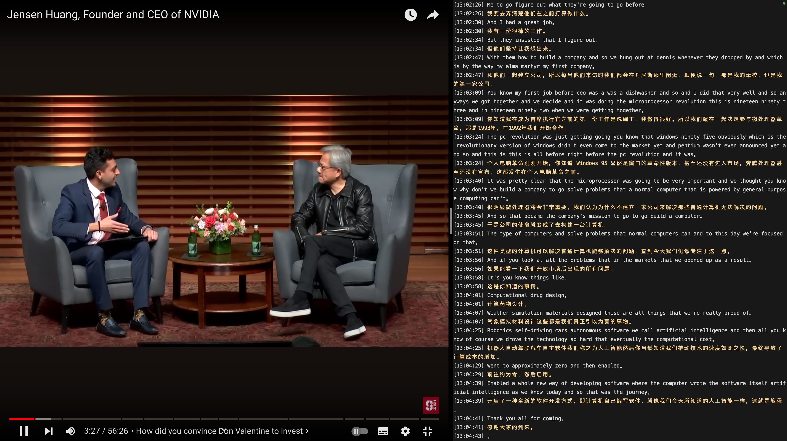
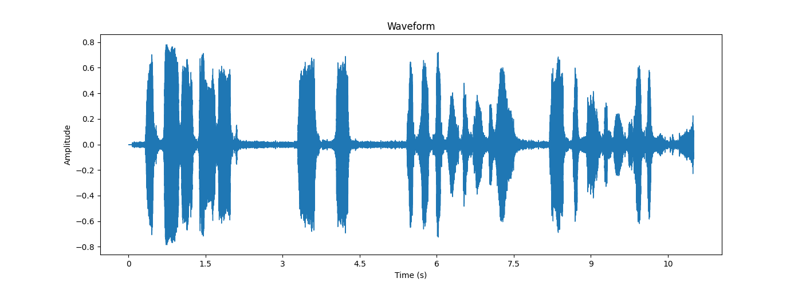

## Real-time Subtitles

An open-source, lightweight macOS real-time subtitle application that provides high-quality bilingual streaming subtitles when listening to podcasts or watching videos. Utilizes Silero-Vad + Whisper for automatic speech recognition (ASR), and DeepSeek-V3 model API for subtitle translation.

[](https://www.youtube.com/watch?v=GUIAOTWzZTc)

Build the project:

```shell
git clone -b master git@github.com:ZuoFuhong/subtitle.git

# Disable Nano memory allocator, required for macOS only
export MallocNanoZone=0

mkdir -p build
cd build
cmake ..
make
```

Best experience in fullscreen mode:

```shell
# DeepSeek API_KEY (optional)
export DEEPSEEK_API_KEY=sk-xxxxx

cd build

# Offline mode
./main -m offline

# Server ASR mode
./main -m server -s 9.135.97.184 8000
```

### 2. Speech-to-Text

[Whisper](https://github.com/openai/whisper) offers various model sizes, including small, medium, and large. Different model sizes vary in accuracy, speed, and computational resource requirements.

```shell
# Model download
# small.en supports English only, fast speed, suitable for real-time speech recognition
curl -L --output ggml-small.en.bin https://huggingface.co/ggerganov/whisper.cpp/resolve/main/ggml-small.en.bin

# medium.en supports English only, moderate speed, excellent accuracy, recommended for subtitle conversion
curl -L --output ggml-medium.en.bin https://huggingface.co/ggerganov/whisper.cpp/resolve/main/ggml-medium.en.bin
```

Note: Whisper models may hallucinate severely on long silences, background music, or noisy English audio.

Below is an example of running the ASR service offline using [whisper.cpp](https://github.com/ggerganov/whisper.cpp):

```text
whisper_init_with_params_no_state: use gpu    = 1
whisper_init_with_params_no_state: flash attn = 0
whisper_init_with_params_no_state: gpu_device = 0
whisper_init_with_params_no_state: dtw        = 0
whisper_init_with_params_no_state: backends   = 3
whisper_backend_init_gpu: using Metal backend
ggml_metal_init: allocating
ggml_metal_init: found device: Apple M1 Pro
ggml_metal_init: picking default device: Apple M1 Pro
ggml_metal_init: using embedded metal library
ggml_metal_init: GPU name:   Apple M1 Pro
ggml_metal_init: GPU family: MTLGPUFamilyApple7  (1007)
ggml_metal_init: GPU family: MTLGPUFamilyCommon3 (3003)
ggml_metal_init: GPU family: MTLGPUFamilyMetal3  (5001)

And so my fellow Americans, ask not what your country can do for you, ask what you can do for your country.
```

### 3. Voice Activity Detection

Voice Activity Detection (VAD) determines the presence of speech in audio signals by analyzing their features. It effectively distinguishes and separates speech from non-speech signals.
Here, VAD is used to segment speech portions for Whisper transcription, which greatly reduces hallucinations and improves the efficiency and accuracy of the speech processing system.



Below is the result from a commercial model running offline:

```json
{
	"sentences": [
		{"seId":"1", "seTime":1980, "sourceText":"AND SO MY FELLOW AMERICANS", "startTime":230, "endTime":2210},
		{"seId":"2", "seTime":900, "sourceText":"ASK NOT", "startTime":3290, "endTime":4190},
		{"seId":"3", "seTime":2020, "sourceText":"WHAT YOUR COUNTRY CAN DO FOR YOU", "startTime":5290, "endTime":7310},
		{"seId":"4", "seTime":2300, "sourceText":"ASK WHAT YOU CAN DO FOR YOUR COUNTRY", "startTime":8150, "endTime":10450}
	]
}
```

Use ffmpeg to split audio segments for playback verification:

```shell
ffmpeg -i jfk.wav -ss 00:00:00.230 -to 00:00:02.210 -acodec copy output1.wav
ffmpeg -i jfk.wav -ss 00:00:03.290 -to 00:00:04.190 -acodec copy output2.wav
ffmpeg -i jfk.wav -ss 00:00:05.290 -to 00:00:07.310 -acodec copy output3.wav
ffmpeg -i jfk.wav -ss 00:00:08.150 -to 00:00:10.450 -acodec copy output4.wav
```

Below are segments recognized in streaming mode by Silero-Vad + Whisper:

```shell
{"end":37376,"se_id":1,"start":5120,"text":"And so, my fellow Americans."}
{"end":86016,"se_id":2,"start":53760,"text":"Ask not."}
{"end":129024,"se_id":3,"start":87552,"text":"what your country can do for you."}
{"end":171008,"se_id":4,"start":131072,"text":"Ask what you can do for your country."}
```
